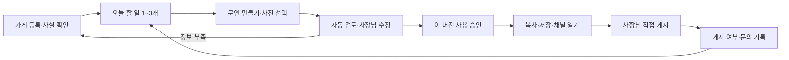

# 소상공인 실사용·수익화 제품 설계와 저장소 리뷰

## 한 장 요약

이 문서는 AI CMO Platform을 소상공인이 휴대폰으로 쓰고 돈을 낼 수 있는 서비스로 만드는 제품 설계입니다. 구현 작업은 [Goal용 체크리스트](2026-09-05-smb-goal-todolist.ko.md) 순서로 진행합니다. 오늘 할 일은 **기존 기록 유실과 가짜 완료를 막는 G01–G05를 착수하고, 첫 고객 업종을 검증할 인터뷰를 준비하는 것**입니다.

**판단:** 마케팅 SOP와 실행 엔진은 재사용 가치가 높지만, 현재 웹은 랜딩 시안 생성 폼입니다. 소상공인이 혼자 등록·생성·수정·승인·성과 확인·결제하는 제품은 아직 아닙니다. 기능 수를 늘리는 것보다 **가게 정보 한 번 등록 → 오늘 필요한 홍보물 완성 → 직접 게시 → 반응 기록 → 다음 주 개선**을 연결하는 것이 우선입니다.

**추천 [제안]:** 지역 카페·베이커리를 첫 검증 업종으로 삼고, 네이버 중심의 가게 소식·리뷰 답글부터 시작합니다. 무료 네이티브 도구를 대신 만드는 데 투자하지 않고, 여러 채널에 쓸 소재 준비와 사실 확인, 반복 작업 단축에 값을 받습니다. 먼저 운영자 보조형 유료 파일럿, 이후 초대형 웹 베타, 마지막으로 공개 구독 서비스 순서입니다.

**미확인:** 실제 타깃 고객 인터뷰, 지불 의향, 개발 인력·예산, 라이브 LLM 가용 모델과 단가, 서비스 운영비, 결제 사업자 계약, 법률·라이선스 검토는 확보하지 않았습니다. 이하 가격·일정·목표치는 모두 검증할 **[추정/제안]**이며 실적이나 매출 보장이 아닙니다. 특정 클라이언트 납품이 아닌 플랫폼 자체 기획이므로 고객 config·브랜드 검증은 N/A입니다.

## 1. 리뷰 범위와 실제 검증

- 기준일: 2026-09-05, 작업 경로 `C:/Users/lg/marketing for companies/ai-cmo-platform`.
- 기준 HEAD: `b8d52ca61cad44175fd7a35656abd806eed5b13f` **및 현재 미커밋 작업 트리**. 레지스트리·새 에이전트·데일리 워크플로 등 미추적 파일도 포함했습니다. 커밋만의 감사 결과로 해석하지 않습니다.
- 전체 폴더·파일 목록과 레지스트리를 대조하고, 핵심 Python 진입점·입력·상태·출력·검토·승인·KB 흐름 및 모든 workflow YAML을 읽었습니다. 플레이북은 전체 목록/등록 관계와 로컬·콘텐츠·런치팩 주요 흐름을 검토했습니다. 모든 Markdown의 모든 주장을 재조사하거나 전 파일에 줄 단위 보안 감사를 한 것은 아닙니다.
- 고객 실데이터·과거 산출물의 민감 내용은 제품 근거로 인용하지 않았습니다. 샘플·템플릿과 플랫폼 공통 문서를 기준으로 했습니다.
- 라이브 LLM 생성, 결제, 외부 발행, 운영 서비스, 실제 사용자 사용성 검사는 실행하지 않았습니다. UI 판단은 코드/테스트에 근거하며 실제 모바일 브라우저 검증은 G23입니다.

| 검증 | 현재 결과 | 해석 |
|---|---|---|
| `.venv/Scripts/python.exe -m pytest -q` | **226 passed, 86.02초** | 로컬 테스트 기준. 서비스 운영·생성 품질·매출 증거는 아님 |
| `.venv/Scripts/ruff.exe check src tests examples` | **11건** | 기존 오류. 예외 구성, mutable default, 복잡도, 테스트 스타일 등 |
| `.venv/Scripts/basedpyright.exe src tests` | **79 errors** | 레지스트리의 Any/Unknown 및 PDF·primer 테스트 등. 실제 수정 후 재검증 필요 |
| `git diff --check` | 오류 없음, CLAUDE.md 줄바꿈 경고 | 기존 diff의 공백 검사 |
| 실제 파일·YAML 집계 | 에이전트 13, 플레이북 Markdown 78, 매핑 74, 모듈 13 | AGENTS의 81개·README의 68개와 다름. 수량 정의를 통일해야 함 |
| 엔진 스펙 | 5개: approval-demo 4단계, blog-article 6, content-engine 11, daily-cmo-loop 10, launch-pack 14 | 플레이북 수가 곧 실행 가능한 제품 기능 수는 아님 |
| 입력/보존 소형 재현 | 빈 웹 폼도 HTML 반환; force 재온보딩 후 KB 표식 소실; 출처 없는 긴 문장 구조검사 PASS | 임시 디렉터리·합성 데이터만 사용. 아래 재현 계약 참고 |

Ruff의 S608은 `step_state.py:_finalize_step`의 동적 SQL 경고입니다. 현재 `set_clause`는 내부 상수이고 값은 바인딩하므로 **확인된 SQL 주입 취약점으로 보고하지 않습니다**. 경고 검토와 설명/국소 조정 대상으로 둡니다.

### 재현 계약

1. `tempfile.TemporaryDirectory` 안에서 `scaffold_client(..., pdf=False)` 실행 → `knowledge-base/probe/insights.md`에 합성 표식 추가 → `scaffold_client(..., force=True, pdf=False)` → 표식 존재 여부 `False`.
2. `generate_page({}).startswith('<!DOCTYPE html>')` → `True`; `answers_from_form({}).company_name` → `브랜드`.
3. `evaluate_artifacts(['출처 없는 주장입니다. ' * 30]).status` → `PASS`. 구조 검사가 사실 검증을 대체하지 못한다는 증거이며, 의미 reviewer 자체의 실패를 재현한 것은 아닙니다.

## 2. 저장소 전체 관점의 준비도

| 영역 | 현재 자산과 근거 | 실사용까지 필요한 일 |
|---|---|---|
| 운영 두뇌 | `AGENTS.md`, `registry/capabilities.yaml`, `capabilities.py`에 자연어 매핑 | 조회 기능을 실제 실행 가능한 제품 메뉴/지원상태와 연결. 매핑만 있는 기능을 실행 가능으로 표시하지 않기 |
| SOP·전문가 | `agents/`, `playbooks/`, `prompts/shared/`의 국내 채널과 품질 규칙 | 업종·사진 보유·시간·예산에 맞는 작은 상품으로 묶기. 전체 SOP 재작성 불필요 |
| 클라이언트 설정 | `onboarding.py`, `clients/_template/`, 내장 온보딩 템플릿 | 지역·영업시간·대표상품·가격·목적·시간 여력·사실 확인을 쉬운 입력으로 받기 |
| 웹·산출물 | `web.py`, `mockup.py`, `primer.py`, `evaluate.py` | 저장·진행·검토·수정·보관 UI 연결. primer의 빈칸 워크북은 완성 전략으로 판매 금지 |
| 실행 신뢰성 | `runner.py`, `step_executor.py`, `models.py`, `spec.py` | 기존 해시·재개·lease 재사용. 실행기 정책 보존, 중단/예산/취소·작업 큐 보강 |
| 상태·저장 | `db.py`, `schema.py`, `*_state.py`, `store.py` | 가게별 접근 제어와 비공개 산출물, 버전·마이그레이션·복구 설계 |
| 실제 생성 | `adapters.py`, `anthropic_adapter.py` | 스텁과 실제 생성 구분, 모델 사전 확인, 잘림·usage·비용 계측, 웹의 임의 명령 입력 금지 |
| 검토·승인 | `gate.py`, `reviewer_contract.py`, owner_gate | 납품 대상 전체를 검토하고 승인 버전에 묶기. 사람 승인과 외부 게시 완료 구분 |
| 파일 전달·입력 | `ingest.py`, `cli/run_cmds.py`, Markdown/HTML/PDF 유틸 | URL 내용 확보 상태, 민감 파일 요약, 미리보기·복사·유효한 파일 내보내기 |
| 학습 | `reporter.py`, `feedback.py`, KB 큐 | 운영 메시지가 아닌 실제 채택/수정 이유를 저장. 재온보딩 덮어쓰기 방지 |
| 통합·이관 | `integrations/birkin/`, `skills/birkin/`, `handoff/`, `templates/handoffs/` | 문서상 handoff와 실제 연결 상태 구분. 소상공인 기본 경로에서는 숨기기 |
| 개발·배포 | `pyproject.toml`, `tests/`, `scripts/doc_counts.py`, 사용설명서 | 깨끗한 검사 기준, 설치/운영 방법 단순화. 상용 배포·요금·권한·관측 기능 추가 |
| 기존 전략 | `docs/product/sellable-positioning.md`, `okara-gap-analysis.md`, `docs/system/` | 공유용/비판매 선언과 이번 유료 서비스 방향을 구분하고 정리. 과거 문서의 완료 주장을 코드와 대조 |

### 우선 해결할 발견사항

| ID | 심각도/영향 | 근거 | 제품 결정 / 연결 작업 |
|---|---|---|---|
| F01 | P0·기록 유실 | `onboarding.py:99`, `:128–130`: force 시 KB 템플릿 재기록; 위 임시 재현 | 프로필 수정과 최초 생성 분리, 기존 KB 보존·백업 / G03 |
| F02 | P0·가짜 완료 | `adapters.py:99`, `gate.py:78`, YAML의 PASS/WARN 허용 | demo/실행성공/검토완료/사용가능 별도. 유료 산출물에 스텁 금지 / G04 |
| F03 | P0·맥락·생성기 불일치 | `cli/run_cmds.py:resume_run`, `schema.py:run_policies`: phase-git만 보존; 실행기는 재선택 | 재개 때 생성기/모델/검토 정책 보존, 묵시적 local 전환 금지 / G05 |
| F04 | P0·검토 누락 가능성 | `step_executor.py:404`, `:417`: reviewer 선택형·입력 축약; refs도 제한됨 | 납품 파일/버전별 검토 커버리지. `[미확인]` 주장·기간 만료·가격 확인 / G04, G07 |
| F05 | P1·입력 부담과 허구 유도 | `onboarding.py:25–73` proof 필수, `web.py:65–80` 빈 값 허용, 설정 두 파일만 생성 | 웹/CLI 공통 검증, ‘아직 후기 없음’, 확인된 사실만 사용 / G06, G18 |
| F06 | P1·채널 부적합 | daily YAML의 Reddit 조사/X 초안 고정; `channels`는 문자열 입력 | 가게 설정에 따른 국내 채널 allowlist, Lite 작은 실행 / G08 |
| F07 | P1·조사 결과 오인 | `ingest.py:parse_urls`는 URL 파싱, Anthropic Messages 호출에 fetch 도구 없음 | URL만으로 읽었다고 표시 금지. 사용자 제공 내용/확보된 원문만 근거 / G07 |
| F08 | 공개 전 차단·고객 격리 없음 | `web.py` 인증 없음, `schema.py` 계정/tenant/권한 없음 | 승인·다운로드 포함 전 경로에 가게 소유권 검사. CLI 로컬 운영과 공개 SaaS 분리 / G17, G22 |
| F09 | 공개 전 차단·개인정보 처리 부족 | `redaction.py:11` 이메일·전화번호 보존, 파일 내용은 agent로 전달됨 | 공개 매장 연락처와 고객 PII를 구분해 입력/LLM/로그 경계에서 최소화 / G07, G22 |
| F10 | P1·가격·원가 불명 | `anthropic_adapter.py:24`, `:96–107`: 2048 기본·text만 반환 | 잘림 감지, 요청별 usage/재시도/비용, 예산 상한 / G09 |
| F11 | P1·웹 가치 경로 단절 | `web.py:32–112` 폼/시안 반환만, runner/scaffold 미연결 | 오늘 할 일·편집·승인·성과 웹 / G16–G24 |
| F12 | P2·지속성 과장 | `runner.py:123` 순차 loop, 데일리 YAML에 시간 트리거 없음 | DAG는 실행 순서이지 실제 병렬/매일 예약 증거가 아님. 수요 검증 후 OS 스케줄러 / G29 |
| F13 | P2·학습 과장 | `step_executor.py:489` 큐 본문은 운영 상태, `reporter.py`는 그 본문을 append | 실제 수정 차이/채택 이유/관측 성과를 Reporter 검증 후 축적 / G12, G24 |
| F14 | P1·약속과 구현 불일치 | README의 숫자·phase-git 설명, 내장 primer의 빈칸, mockup CTA `href="#"` | 사용가능·미구현·데모를 문서/메뉴에서 구분. 랜딩을 팔 경우 실제 목적지 필수 / G01, G10 |

강점은 지켜야 합니다. 경로 containment, Pydantic 스펙 검증, SQLite WAL, 성공 상태·해시 기록, lease heartbeat, 승인 대기 스냅샷, 재개 시 변경 감지는 이미 있습니다. 이를 지우고 새 엔진·벡터 DB·마이크로서비스를 만드는 것은 초기 가치에 기여하지 않습니다. 승인 당시 리뷰 결과와 편집 후 파일 전체가 같은 버전인지는 추가 계약으로 확인합니다.

## 3. 누구의 어떤 일을 먼저 끝낼 것인가

아래 선택은 시장 규모 추정이 아니라 검증 비용을 줄이기 위한 **제품 가설**입니다.

| 대상 | 반복 업무 | 첫 상품 적합도 [가설] | 순서 |
|---|---|---|---|
| 동네 카페·베이커리 1개 매장 | 신메뉴/휴무 소식, 지역 게시물, 리뷰 답글 | 사진·가격·운영시간이 비교적 명확하고 주간 반복 검증 가능 | 첫 업종 |
| 네일·미용·공방 등 예약 업종 | 빈 시간 안내, 시술/작품 소개, 예약 유도 | 객단가·재방문 관찰 가능하나 고객 사진 동의·예약 정보 취급 필요 | 첫 업종 반복 사용 통과 후 |
| 동네 소매·빈티지·온라인 판매 | 일품 재고, 제품 설명, 품절 대응 | 재고·가격 최신성 부담이 커 별도 계약 필요 | 후속 업종 |
| 대행사·다점포 운영자 | 여러 가게 검토·납품·성과 관리 | 높은 계약금 가능성 대신 권한·검토자·매장 간 격리 필요 | 단일 매장 증명 후 |

**첫 사용 상황:** “이번 주 신메뉴 사진은 있는데 네이버에 무슨 말을 올릴지 모르겠어요.”

**첫 결과 약속 [제안]:** 사실 확인된 가게 정보로 첫 소식 1건을 만들고, 사장님이 수정·복사해 직접 게시할 수 있습니다. 작성 시간 단축을 검증하되 매출·순위 상승을 약속하지 않습니다.

**첫 주 최소 상품 [제안]:** 주력 채널 소식 2건 + 입력한 리뷰 답글 최대 5건 + 주간 실행 카드 1장. 블로그는 명시 선택 시 1편 추가합니다. 기존 AGENTS Lite의 블로그 1편/SNS 3개/리포트와 다르므로 **G08에서 공통 정책·레지스트리·테스트까지 같이 개정**하고, 조용히 기존 규칙을 무시하지 않습니다.

초기에 숨길 메뉴: GTM·ICP·퍼널·GEO·Reddit/HN·LinkedIn·아웃바운드·인플루언서 정산·광고 자동 집행. 운영자용 고급 기능으로 남기되 사장님 홈에 늘어놓지 않습니다.

## 4. 기능과 UX 설계

### 4.1 정보 구조

모바일 하단 메뉴는 **오늘 / 만들기 / 보관함 / 성과** 네 개입니다. 가게명 버튼에서 가게 정보·도움말·이용권으로 이동합니다. 운영자 콘솔은 별도 권한 화면입니다. 자유 채팅은 보조 입력이며 시작 화면은 실제 업무 선택으로 구성합니다.



### 4.2 화면별 동작 계약

| 화면 | 보이는 내용·주 행동 | 예외/완료 상태 | 연결 |
|---|---|---|---|
| 시작 | “이번 주 가게 홍보, 한 건부터 준비해요”; 실데이터 아닌 예시 명시 | 샘플 보기와 내 가게 등록 분리; 샘플은 사용량 미차감 | G16, G18 |
| 가게 등록 | 3단계: 가게·동네 → 대표상품·가격·영업시간 → 목표·채널·주당 시간 | 임시저장/뒤로/‘모름’ 보존. 위치 정밀 GPS 불필요. 후기 없음 허용 | G06, G18 |
| 오늘 | 가장 필요한 일 1개를 위에, 최대 3개; 필요한 사진/시간/이유 | 일정 없는 날 억지 콘텐츠 생성 금지. 데이터 없음과 오류 구분 | G19 |
| 만들기 | 신메뉴·휴무·이벤트·리뷰 답글 선택, 사실 확인 후 생성 | 사진 없으면 텍스트형/촬영 안내; 생성 불가 시 비용·재시도 설명 | G08, G09, G20 |
| 결과 편집 | 채널 형태 미리보기, 제목/본문/사진, 간단 수정 3개 | 저장 중/저장됨/실패, 버전 복원, 출처 없는 가격/후기 표시 | G20 |
| 사용 승인 | 문안·사진·가격·기간 최종 확인, “이 내용으로 사용할게요” | 수정하면 승인 무효. PASS/WARN 사유를 쉬운 말로 표시 | G21 |
| 직접 게시 | 문안 복사, 승인된 파일 저장, 해당 채널 공식 화면 열기 | 복사 실패 시 선택 복사. “복사 완료”를 “게시 완료”로 표시 금지 | G21 |
| 보관함 | 가게·기간·채널·상태별 목록, 복제·수정·보관 | 만료 이벤트 배지, 이전 승인 버전 표시, 빈 목록 시작 버튼 | G20, G21 |
| 성과 | 직접 입력/파일 출처·기간·업데이트 시각, 문의/예약/게시 건수 | 미입력은 ‘아직 기록 없음’; 0은 확인된 0. 이전 기간 분모 0이면 증감률 미표시 | G11, G24 |
| 이용권 | 포함 건수/남은 건수/결제금액/다음 결제일/해지 | 자동 초과청구 없음. 실패·해지·환불·보관기간 상태 명시 | G09, G25–G28 |
| 도움말 | 화면 안 짧은 안내·문의 작성·운영시간 | 외부 자동 메시지는 보내지 않음. 운영자 지원 이력/응답시간 기록 | G14, G23 |

### 4.3 핵심 와이어프레임 [설계안, 구현 화면 아님]

```text
오늘                         [내 가게]
이번 주 홍보 1건이 준비됐어요

신메뉴 소식 확인하기
네이버 · 사장님 확인 필요
사진 1장과 가격을 확인해 주세요
[문안 확인하기]

그다음 할 일
리뷰 답글 2건  [보기]
이번 주 문의 수 [기록]

[오늘] [만들기] [보관함] [성과]
```

```text
< 돌아가기          네이버 소식
초안 · 아직 게시되지 않았어요

[선택한 실제 상품 사진]
제목 [확인된 신메뉴 소개 문안]
본문 [편집 가능한 완성 문안]
[더 짧게] [친근하게] [가격 수정]

확인할 내용: 가격 · 판매기간
수정 내용 저장됨 / 버전 3
[이 내용으로 사용할게요]
```

```text
사용 준비 완료 · 버전 3
[문안 복사] [사진 저장] [게시 방법]
[네이버 공식 화면 열기]

직접 게시한 뒤 알려주세요
[게시했어요] [나중에 할게요]
게시 주소는 선택 입력
※ 게시 여부는 사장님 기록 기준
```

와이어프레임의 숫자·문구는 **합성 예시**이며 실제 가게 데이터가 아닙니다.

### 4.4 시각·접근성·언어

- **[제안]** 본문 16–18px, 주 버튼 높이 48px 이상, 모바일 한 열, 화면별 주 행동 하나. 기존 녹색 계열을 유지하되 정보/경고를 색만으로 전달하지 않습니다. CSS와 HTML 기본 요소 우선입니다.
- 일반 텍스트 명도 대비 4.5:1, 큰 글자 3:1, 200% 확대·키보드 사용·가려지지 않는 포커스 기준을 검증합니다. 48px은 제품 목표이지 WCAG AA 최소치라는 주장이 아닙니다. [W3C WCAG 2.2](https://www.w3.org/TR/WCAG22/) (2026 열람)
- “workflow/agent/token/gate” 대신 “만드는 중/문안/이용량/확인 필요”. 내부 단계명·로그는 운영자 상세에서 봅니다.
- 로딩에는 마지막으로 확인한 상태와 취소/돌아가기 제공. 근거 없는 진행률 93%, 정확한 남은 시간 약속 금지.
- `required`, 연결된 label, 오류 요약·항목별 설명, `aria-live` 상태, 파일 형식·용량 안내. 새로고침·뒤로가기 후 입력 보존.
- 모바일 360/390px, 데스크톱 1280px 및 200% 확대에서 확인합니다 **[제품 테스트 규격 제안]**. 테스트는 합성 가게 데이터로 실시합니다.

## 5. 구현 설계: 기존 엔진 위에 작은 서비스

### 5.1 기술 선택과 경계

**[제안]** Python 단일 웹 앱 + 서버 렌더링 템플릿 + 필요한 부분만 JavaScript + 단일 작업 worker로 시작합니다. 공개용 인증·세션·CSRF·ORM·관리자 화면은 검증된 프레임워크의 기본 기능을 쓰며 직접 보안 프레임워크를 만들지 않습니다. 구체적 후보는 Django이고, G16에서 공식 문서·현재 유지 상태·배포 조건을 확인한 뒤 확정합니다. Python 엔진을 호출하며 CLI를 웹 요청마다 셸로 실행하지 않습니다.

Django 공식 문서에서 계정·그룹·권한·세션과 CSRF 지원을 확인했습니다. 다만 **가게별 객체 접근 권한과 로그인 시도 제한까지 기본 제공된다는 뜻은 아닙니다**. G17/G22에서 따로 구현·검증합니다. 현재 링크는 기능 근거이며 채택 버전을 고정한 결정은 아닙니다. [Django 인증](https://docs.djangoproject.com/en/5.2/topics/auth/), [CSRF](https://docs.djangoproject.com/en/5.2/ref/csrf/), [개요](https://docs.djangoproject.com/en/5.2/intro/overview/) (2026 열람)

현재 `http.server` 시안 서버는 로컬 데모 용도로 유지합니다. 공개 서비스용 권한·세션을 거기에 모두 수작업으로 덧붙이지 않습니다. React/Next 전면 도입, 모바일 네이티브 앱, Kubernetes, 벡터 DB는 초기 범위에서 제외합니다.

초대형 단일 서버 베타에서는 기존 SQLite/파일 산출물을 재사용할 수 있습니다. 웹 업무 DB와 엔진 원장은 책임을 구분하고 `tenant_id ↔ run_id`의 신뢰된 서버 매핑을 둡니다. 복수 프로세스의 DB 잠금·큐 대기·백업 시간을 측정한 뒤 PostgreSQL 등으로 옮깁니다. SQLite 자체를 결함이라고 취급하지 않습니다.

### 5.2 최소 데이터 계약 [신규 설계]

| 객체 | 최소 필드/규칙 | 기존 자산 활용 |
|---|---|---|
| 가게/구성원 | tenant_id, 소유자, 역할 owner/operator, 초대/해지 상태 | client slug는 표시/폴더 연결용, 권한 증명으로 사용 금지 |
| 가게 프로필 | 구조화 필드, 확인 상태·확인일·근거, revision | `clients/{client}/config.md`를 설정 원천으로 유지. 구조화된 메타 영역을 검증/원자 갱신하고 DB는 파생 인덱스만 유지 |
| 요청/작업 | request_id, tenant_id, purpose, channel, run_id, 실행기 정책, 상태, 중복 방지 키 | runner/store 재사용, 기존 run 정책을 확장 |
| 홍보물 | artifact_id, tenant_id, run_id, version, title/body, 실제 파일 refs, source refs, 상태, 행사 기간 | Markdown/JSON 원본 유지, 화면은 명시적 필드 렌더링 |
| 검토/승인 | artifact version/hash, 검토 상태·사유, 승인자/시각, 사장님 수정 | 기존 gate/events를 연결, 이전 승인으로 새 버전 승인 금지 |
| 사용량 | request/attempt, provider/model, 실제 tokens/cost 또는 unavailable, 예약/확정/해제 | 스텁·실패는 상품 사용량 차감 안 함. 실제 공급자 비용은 실패에도 기록 |
| 결제/이용권 | 주문/PG 거래 ID, 금액/통화, 상태, 포함량/기간, 환불 이벤트 | 신규. 중복 이벤트 unique, 서버 가격표만 신뢰 |
| 성과 | tenant, 기간, 채널, 지표, 값, 입력/파일 출처, 갱신일, 관측/추정 | 기존 주간 보고 SOP에 연결. 고객 개인별 원시 CRM 저장은 기본 제외 |

프로필 저장은 revision 충돌 검사 → 임시 파일 → 원자 교체 → 파생 인덱스 갱신으로 처리합니다. 파일·DB 간 실패 시 인덱스를 원천 파일에서 재구축합니다. `config.md`와 DB를 동시에 독립 수정 가능한 두 원천으로 만들지 않습니다. 가게 수정은 기존 KB를 재생성하지 않습니다.

### 5.3 서비스 동작 계약

| 요청 예시 [설계] | 서버가 강제할 것 |
|---|---|
| `POST /shops` 또는 프로필 저장 | 로그인/CSRF, 필드 검증, 확인된 사실만 저장, 안전한 서버 slug |
| `POST /jobs` | tenant 멤버십, 지원 업무/채널 allowlist, 사용량 예약, 중복키, `202 + job_id` |
| `GET /jobs/{id}` | 자기 가게만 조회, 단계 요약/오류·재시도 가능 여부, 비밀 로그 제외 |
| `PATCH /assets/{id}` | tenant/version 검증, 수정 이력, 승인 무효화, 낙관적 충돌 시 복원 UI |
| `POST /assets/{id}/approve` | 현재 hash 검토 완료 확인, 동일 버전 승인, 로그 보존 |
| `GET /assets/{id}/export` | tenant와 허용 버전 검사, 명시적 다운로드 클릭, 실제 MIME/파일 검증 |
| `POST /assets/{id}/posted` | 사장님 신고로 기록, 관측 출처 `owner_reported`, 외부 게시 성공으로 자동 간주 금지 |
| `POST /metrics/import` | PII 제거·요약 미리보기 후 확정, 중복 업로드 차단 |
| 결제 승인/웹훅 | 서버 주문금액 검증, PG 공식 검증법, 중복·역순·재전달에 안전한 이용권 전환 |

LLM HTML은 신뢰된 앱 DOM에 직접 넣지 않습니다. 생성 문안은 escape, 별도 HTML 시안은 격리된 sandbox 미리보기, 사진은 MIME/크기/권리 확인 후 사용합니다. 웹에서 executor 명령·repo 경로·임의 파일 경로를 입력받지 않습니다.

작업 상태는 **대기 → 생성 중 → 검토 중 → 확인 필요 → 사용 준비 → 게시 기록됨**이며 실패/취소가 별도로 있습니다. DB의 run success는 이 UX 상태의 일부 증거입니다. 프로세스 종료 시 미완료 작업 재점유, 재시도 상한, 취소 후 결과 납품/차감 방지, 같은 요청 중복 생성 방지를 G05/G09/G17에서 검증합니다.

### 5.4 결과 품질 계약

유료 결과는 실제 생성 출처, 확인된 가게 facts, 제목/본문/CTA, 채널 규격, 사진의 실제 경로 또는 명시적 부재, 유효기간, 파일별 검토 상태를 갖습니다. 모르는 가격·후기·할인율을 채워 넣지 않습니다. 채널 규격은 공식 URL·검증일·메시지 유형과 함께 버전 관리합니다.

초기 원문 입력은 사용자 제공 텍스트/파일로 제한할 수 있습니다. URL만 있을 때 `source_status=not_fetched`로 두고 본문 요청 또는 조사 보류를 안내합니다. 나중에 공개 URL 수집을 붙이면 외부 다운로드 승인, SSRF/리다이렉트/내부 IP/용량/타임아웃 정책과 출처 스냅샷을 먼저 정의합니다. CLI 도구가 임의로 읽어 줄 것이라고 가정하지 않습니다.

자동 검토의 WARN은 유형별 처리합니다. 사진 없음처럼 선택 구성 누락은 제한을 표시해 사용 가능할 수 있지만, 가격·사실·광고 표시·개인정보 문제는 납품을 막습니다. 사장님 승인으로 안전성 FAIL을 덮어쓰지 않습니다. 편집 후 검토·승인을 다시 연결하고 그 파일만 내보냅니다.

## 6. 경쟁·수익화 설계

### 6.1 무엇에 값을 받을 것인가

- 네이버는 업체 등록/수정, 리뷰, 예약/주문에 대한 자체 운영 도구와 안내를 제공합니다. **[설계 판단]** 등록 기능 자체를 복제하는 것보다 그 화면에 넣을 검증된 콘텐츠 준비가 우리의 역할입니다. [네이버 사업주 고객센터](https://help.naver.com/service/30026/category/bookmark?lang=ko) (2026 열람)
- 당근은 무료 업체 등록과 소식·채팅·쿠폰·단골 기능을 안내합니다. **[설계 판단]** 무료 플랫폼 기능에 추가로 사장님이 실제 지불할 ‘작성·관리 시간 절감’을 인터뷰로 증명해야 합니다. [당근 공식](https://business.daangn.com/), [비즈프로필](https://business.daangn.com/business-profile/about) (2026 열람)
- Buffer 공식 가격에는 무료 3채널, 연간 결제 기준 Essentials 1채널 월 $5, Team 월 $10 및 승인 워크플로가 안내됩니다. 한국 채널 미지원 전체를 단정하지 않습니다. **[설계 판단]** 범용 글 생성/예약 도구와 가격 경쟁하기보다 국내 업종의 사실 확인·소식·리뷰·다음 행동을 한 묶음으로 제공해야 합니다. [Buffer 가격](https://buffer.com/pricing) (2026-09-05 열람)
- 카카오 공식 가이드는 일반 메시지 15원/건, 타겟 메시지 20원/건, VAT 별도를 안내합니다. 발송 조건/정책은 실제 사용 시 재확인하며 **서비스 구독료와 외부 발송비를 분리**합니다. [카카오 메시지 가이드](https://kakaobusiness.gitbook.io/main/channel/run/message) (2026 열람)

시장 규모·매출 전환율은 이번 조사로 확정하지 않습니다. 상세 출처 메모는 `docs/research/2026-09-05-smb-product-research.md`에 저장하며 핵심 URL은 이 문서에도 남깁니다.

### 6.2 판매 순서와 상품 [가격·범위 모두 제안]

| 상품 | 가격 가설(VAT 포함) | 정확한 월 범위 | 검증/출시 조건 |
|---|---|---|---|
| 체험 | 무료 1회 | 합성 데모 + 내 가게 텍스트 초안 1건; 무제한 생성 아님 | 스텁 명시, 사실 확인, 비용 상한 적용 |
| 운영자 보조 파일럿 | 월 149,000원 | 한 가게/주력 1채널, 소식 8건·리뷰 답글 20건·주간 요약 4건, 수정 1회/건, 상담·수동 검토·지원 총 90분 상한 | 첫 판매. 실제 발행은 사장님. 상한 초과는 별도 제안에 동의 후 진행 |
| 셀프서비스 | 월 49,000원 | 한 가게/최대 2채널, 소식 12건·답글 30건·주간 요약 4건, 수정 생성 1회/건 | 초대 웹 베타·원가·반복 사용 통과 후 출시 |

원본 게시물 1건을 채널 2개에 맞춰 생성하면 2건입니다. 단순 수동 편집·복사·다시 저장은 무료이고, 시스템 오류로 재생성한 건은 차감하지 않습니다. 고객 요청 수정 생성의 추가 한도는 실행 전에 표시합니다. 초과는 자동 결제 없이 다음 기간 대기/명시적 구매로 처리합니다. 이미지 생성·영상·블로그·광고 집행·촬영·메시지 발송료는 위 월 범위에 포함하지 않습니다. 사진은 사장님 제공 실제 사진 우선입니다.

초기에는 한 가지 파일럿 상품만 판매합니다. 셀프서비스가 준비되기 전에 3단계 요금제를 동시에 운영하지 않습니다. 기본 저장소 공개/공유 유지와 유료 호스팅·지원은 양립 가능한 사업 선택이지만, 실제 LICENSE/참조 자료 권리와 공급자 상업 이용 조건은 G02에서 확인합니다. 기존 ‘not sold’ 문구는 이번 사업 방향 확정 후 정리합니다.

### 6.3 단위 경제성 [모든 비용·세무 계산은 단순 시나리오]

세후 이익이 아니라 상품별 **공헌이익**을 봅니다. 계산 편의상 공급가액=소비자가/1.1, PG비=소비자가의 3%, 지원 인건비=시간당 20,000원을 가정했습니다. 실제 과세·계약·비용은 G02/G09에서 확정하며 아래 식을 재계산합니다.

| 월 시나리오 | 공급가액 | AI 비용 | 인프라 배분 | PG 가정 | 사람 시간 비용 | 공헌이익/비율 |
|---|---:|---:|---:|---:|---:|---:|
| 셀프서비스 49,000원, 지원 10분 | 44,545 | 6,000 | 1,500 | 1,470 | 3,333 | **32,242 / 72.4%** |
| 동일 요금, AI 2배·지원 60분 | 44,545 | 12,000 | 1,500 | 1,470 | 20,000 | **9,575 / 21.5%** |
| 보조형 149,000원, 전체 사람 작업 90분 | 135,455 | 10,000 | 2,000 | 4,470 | 30,000 | **88,985 / 65.7%** |

소수점 반올림으로 1원 오차가 있을 수 있습니다. 환불·세무·고정 인건비·개발비·영업비·채널 광고비는 표에 포함하지 않았으므로 영업이익으로 읽지 않습니다. 파일럿은 AI비뿐 아니라 **상담·팩트 확인·편집·지원 전 시간을 계측**해야 합니다.

공헌이익 32,242원일 때 월 고정비 3,000,000원 가정의 단순 손익분기 고객 수는 `ceil(3,000,000 / 32,242) = 94곳`입니다. 이것은 매출 전망이 아닙니다. 동일 조건의 CAC(유료 고객 확보 비용) 60,000원 가정 회수기간은 약 1.86개월이며 이탈/미수/환불을 빼지 않은 단순 계산입니다. 실제 장기 유지 데이터 전에는 LTV를 확정하지 않습니다.

### 6.4 고객 검증과 판매 실험

1. **G13:** 카페/베이커리 5명과 예약형 업종 5명, 총 10명 인터뷰 **[제안 표본]**. 최근 실제 게시 과정, 소요 시간, 사용 도구·지출, 가장 귀찮은 일, 원치 않는 자동화, 가격 거절 이유를 기록합니다. 참가자 연락/메시지 발송은 운영자 담당이며 이번 기획에서 자동 수행하지 않습니다.
2. **G15:** 동일 업종 5곳으로 4주 유료 파일럿 **[실험 설계]**. 동의 받은 자료만 입력하고 결과 채택률·지원 시간·실제 결제·게시 기록을 측정합니다. 내부 샘플은 고객 성공 건수에서 제외합니다.
3. **G27:** 초대형 웹에서 20곳·4주 코호트 **[목표]**로 셀프 완료 여부를 검증합니다. 채널 광고 확장 전 직접 소개/자발적 신청 고객부터 시작합니다.
4. **G28/G31:** 두 번째 결제 주기가 관측된 뒤 유료 유지와 공헌이익으로 공개·유입 확대 여부를 결정합니다. ‘좋아요’와 생성 건수만으로 통과시키지 않습니다.

가장 중요한 지표는 **매주 사장님이 실제 업무에 사용했다고 기록한 검토 완료 산출물이 있는 가게 수**입니다. 직접 게시 보고는 매출 증거가 아니므로, 문의·예약·쿠폰 사용 수를 별도로 기록하고 계절성/할인/영업일 변화를 함께 표시합니다.

## 7. 출시 로드맵과 통과 기준

인원 **[추정]**: 엔지니어 2명, 제품/디자인·CS·영업 역할 각 일부 시간. 초대 베타까지 약 8–12주, 공개 결정까지 12–16주를 가설로 두되 실제 견적·외부 의존성에 따라 다시 잡습니다. 날짜가 왔다고 통과시키지 않습니다. 작업별 크기는 체크리스트 기준이며 고객 검증 대기 시간은 개발시간과 별도입니다.

| 단계 | 범위 | 시작/완료 조건 | 다음 단계 결정 |
|---|---|---|---|
| A. 기준·보존·품질 | G01–G07 | 재현된 KB 보존, 데모 납품 차단, 검토/정책/입력 계약 검증 | 실제 고객 자료를 받아도 되는지 판단 |
| B. 팔 수 있는 작은 묶음 | G08–G15 | 로컬 실행팩, 실측 비용, 게시 패키지, 성과 수기 입력, 파일럿 운영 준비 | 운영자 검토를 포함한 유료 파일럿 시작 |
| C. 혼자 쓰는 초대 웹 | G16–G24, G26–G27 | 권한·큐·편집·승인·보관·접근성·복구, 실제 모바일 테스트 | 초대형으로 반복 사용 검증; 초기 청구는 운영자 처리 가능 |
| D. 구독·공개 판단 | G25, G28 | 결제 sandbox·해지·환불·이용권·사용량 일치, 보안·법무·운영 체크, 두 번째 주기 관측 | 공개는 운영자 최종 결정. 미달이면 베타 유지 |
| E. 검증된 확장 | G29–G34 | 반복 사용·경제성 통과 및 실제 수요 | 예약 생성, 후속 업종, 파트너, 승인 기반 연동을 순서대로 검토 |

### 측정 정의와 임계값 [모두 제안]

| 지표 | 분자/분모·관찰창 | 초기 목표 | 미달 시 |
|---|---|---|---|
| 첫 가치 도달 | 첫 프로필 입력 시작→검토된 첫 소식 승인·복사까지. 온보딩 시작자 모두, 중도이탈 별도 | 중앙값 15분 이내 | 생성 지연·입력 필드를 줄임; 광고 확대 보류 |
| 사용성 | 5명 중 도움 없이 등록→편집→복사 완료한 인원, 실제 휴대폰 | 4/5명 이상 | G18–G23 재설계 |
| 유료 파일럿 유지 | 시작 5곳 중 4주째에도 주 1회 이상 사용 보고한 가게 | 3/5곳 이상 | 기능 추가보다 이탈 인터뷰·상품 범위 조정 |
| 채택률 | 7일 내 승인 후 복사/내보내기한 산출물 수 / 납품한 검토 완료 산출물 수 | 60% 이상 | 템플릿·시점·채널을 수정 |
| 비용·품질 | 실제 원가 포함 월 공헌이익률; 유료 고객 완결 월 단위 | 60% 이상, 중대 사실 오류 0건 목표 | 한도/가격/지원 범위 조정, 오류 원인 해결 |
| 초대 베타 활성 | 20개 초대 가게 중 7일 내 첫 결과 승인·복사한 가게 | 12/20곳 이상 | 유입 늘리지 않음 |
| W4 유지 | 첫 주 활성 가게 중 4주차에 승인·사용 기록한 가게 | 50% 이상 | 고객별 사유 분석. 작은 표본 한계 표시 |
| 다음 달 결제 | 두 번째 결제 예정일이 도래한 유료 가게 중 정상 갱신한 가게 | 60% 이상 | 해지 사유·가치·지원비 개선 후 재판단 |

결제 대상 미도래 고객을 미갱신으로 세지 않습니다. 인터뷰 거절·중도이탈을 지우지 않고 분모를 고정합니다. 위 표본은 시장 전체 수요의 통계적 증명이 아닙니다.

## 8. 미루는 기능과 다시 검토할 조건

| 기능 | 지금 미루는 이유 | 다시 검토할 조건 |
|---|---|---|
| 네이버/카카오/당근 일괄 자동 게시 | 공식 지원·권한·실패 복구·승인 범위가 검증되지 않음 | 수동 게시가 반복 사용의 주된 병목이며 공식 API/승인 흐름 확보 |
| 광고비 자동 집행/성과보수 | 매출 귀속·예산 통제 증거 없음 | 소유자 승인·계정·검증 데이터·명시 계약 확보 |
| 네이티브 앱·복잡한 대시보드 | 초대 웹만으로 핵심 가설 검증 가능 | 실제 모바일 웹의 제한이 측정됨 |
| 범용 병렬 에이전트 엔진 | 현재 순차 실행도 좁은 업무에 충분할 수 있음 | 계측상 긴 독립 단계가 첫 가치 시간의 주요 병목 |
| 벡터 검색·자율 메모리 | 파일 KB와 명시적 회고로 시작 가능 | 검색 누락/반복 오류가 측정되고 단순 검색으로 해결 안 됨 |
| 이미지/영상 생성 기본 포함 | 원가·권리·실제 파일 검증·사장님 승인 필요 | 텍스트/실제 사진 상품 유지·경제성 검증 후 별도 상품 |
| 다점포·대행사·국외 채널 | 초기 고객과 사용 흐름이 달라짐 | 단일 매장 검증 후 유료 파트너 후보와 격리 요구 확보 |

## 9. 문서 사용과 완료의 의미

현재 전달물은 **리뷰·설계·구현용 체크리스트**입니다. 이 문서에 적힌 기능을 구현 완료한 것이 아니며, 활성 Goal이나 외부 판매·게시 자동화를 생성하지 않았습니다. Goal에는 전체 사업 성공을 한 번에 맡기기보다 [체크리스트의 시작 프롬프트](2026-09-05-smb-goal-todolist.ko.md)를 사용해 한 마일스톤씩 증거를 남기는 편이 좋습니다.

최종 문서 검증은 [reviewer 기록](2026-09-05-smb-roadmap-review.ko.md)을 따릅니다. 사업 가설의 미확인은 문서의 솔직한 한계이며, 아직 고객 검증이 끝났다는 뜻으로 바꾸지 않습니다.

## 다음 단계

1. 개발 담당: 첫 착수 시 G01–G05의 현 상태를 재확인하고 기록 보존·실행기 정책·납품 판정부터 구현합니다.
2. 제품 담당/운영자: 첫 주에 G02·G13의 권리/공급자 조건 검토와 인터뷰를 준비하고 첫 업종을 확정합니다.
3. reviewer: 각 마일스톤 종료 때 실제 결과·테스트·미확인 항목을 확인한 뒤 다음 단계 진입 여부를 기록합니다.
